<div align="center">


<br/>
<br/>
<br/>
<br/>

<!-- Animated App Name -->
<a href="https://git.io/typing-svg">
  
</a>

<br/>

<!-- Animated Tagline -->
<a href="https://git.io/typing-svg">
  
</a>

<br/><br/>

<!-- Nav Links -->
<p>
  <a href="#-overview">Overview</a> ·
  <a href="#-tech-stack">Tech Stack</a> ·
  <a href="#-project-structure">Structure</a> ·
  <a href="#-features">Features</a> ·
  <a href="#-getting-started">Getting Started</a> ·
  <a href="#-environment-variables">Env Variables</a> ·
  <a href="#-contributing">Contributing</a>
</p>

<!-- Tech Badges -->
<p>
  
  
  
  
  
</p>

<!-- Status Badges -->
<p>
  
  
  
  
</p>

</div>

---

## 📖 Overview

**EducatIN** is a full-fledged EdTech platform built to bridge the gap between local coaching schools and modern technology. Hundreds of neighbourhood coaching centres run on whiteboards and paper — **EducatIN changes that**, giving them the digital infrastructure of a top-tier institution.

Built on a **decoupled (headless) architecture**, the platform cleanly separates content management from presentation — making it fast, scalable, and easy to maintain.

| Layer | Technology | Purpose |
|-------|-----------|---------|
| 🗄️ **Backend** | Strapi v5 | Headless CMS — content, REST APIs, user management |
| 💻 **Web** | Next.js 14 | High-performance admin & teacher dashboard |
| 📱 **Mobile** | React Native (Expo) | Cross-platform app for students & teachers |

---

## 📸 Screenshots


<summary><b>📱 Mobile App — React Native</b></summary>
<br/>

<p align="center">
  
  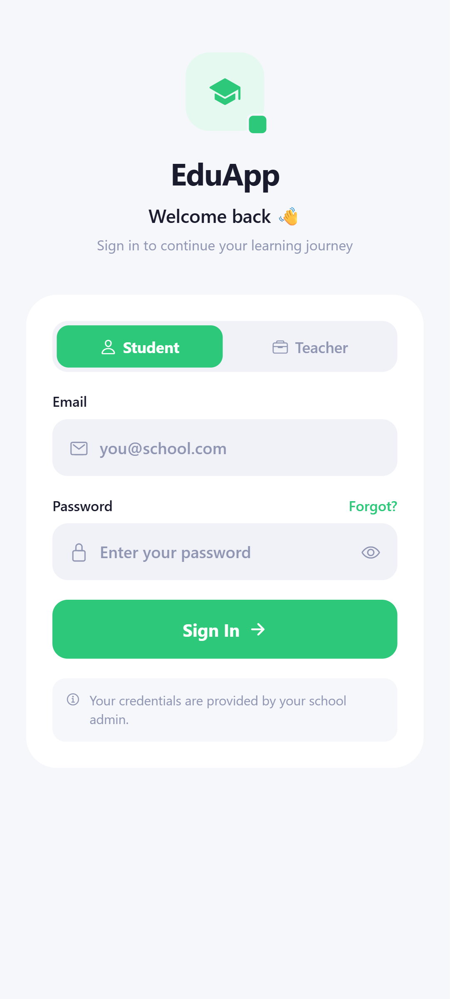
  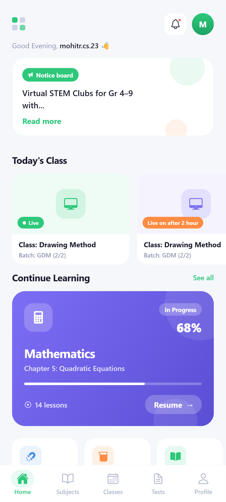
  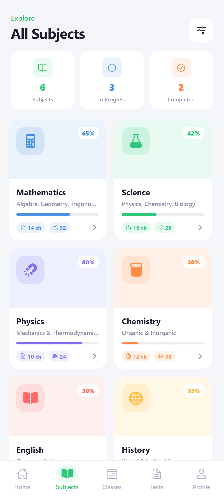
</p>
<p align="center">
  
  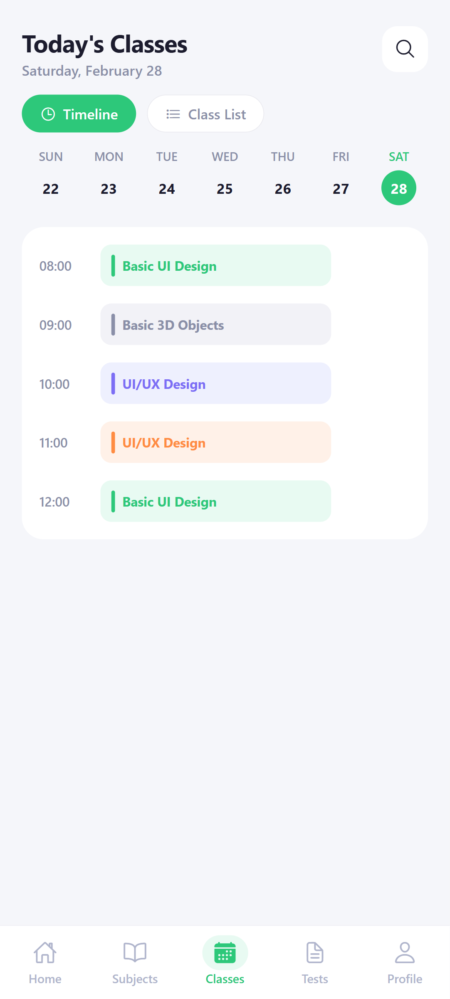
  
  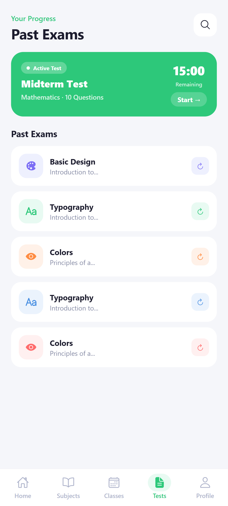
</p>
<p align="center">
  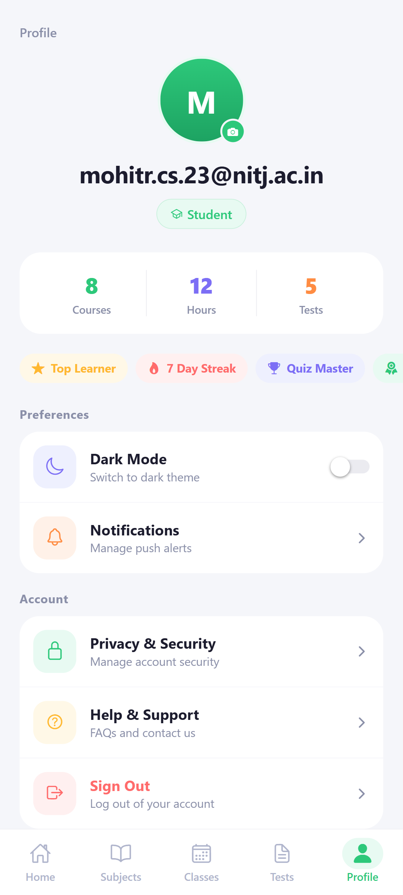
  
  
</p>


<summary><b>💻 Web Dashboard — Next.js</b></summary>
<br/>

<p align="center">
  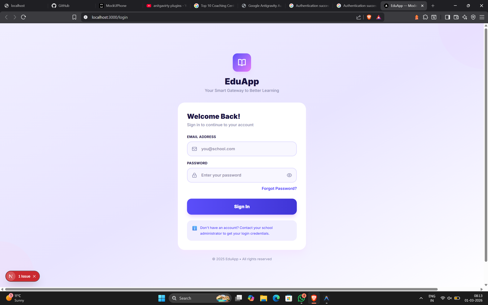
  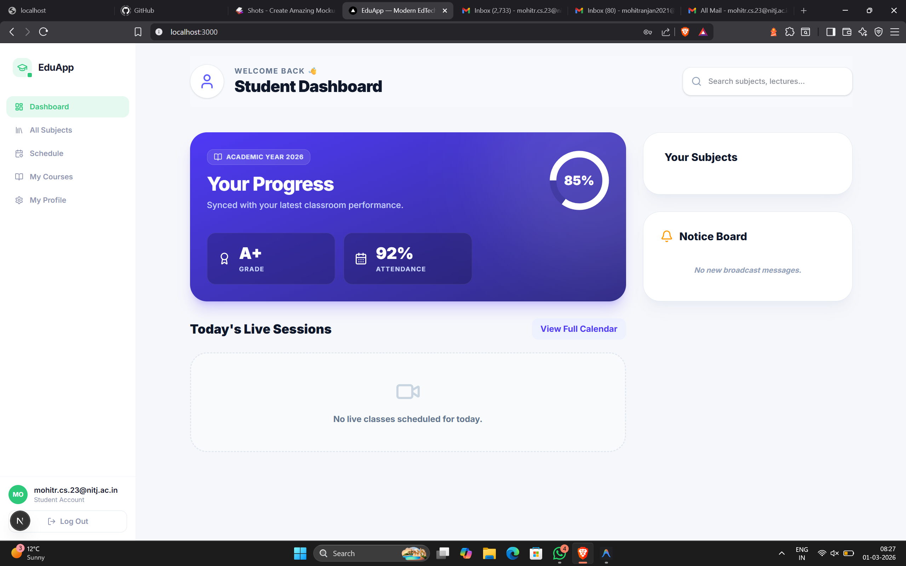
</p>
<p align="center">
  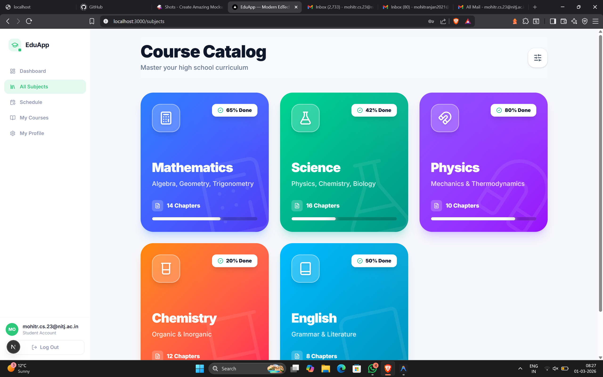
  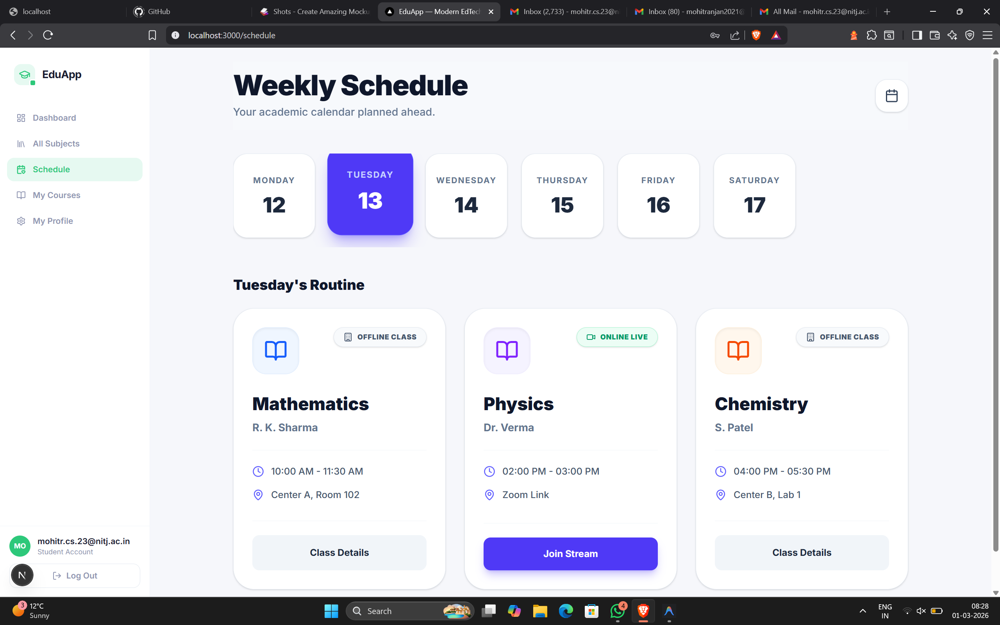
</p>
<p align="center">
  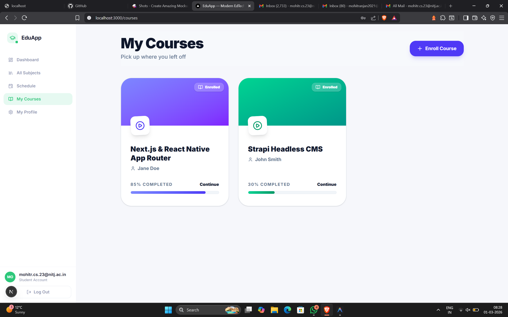
  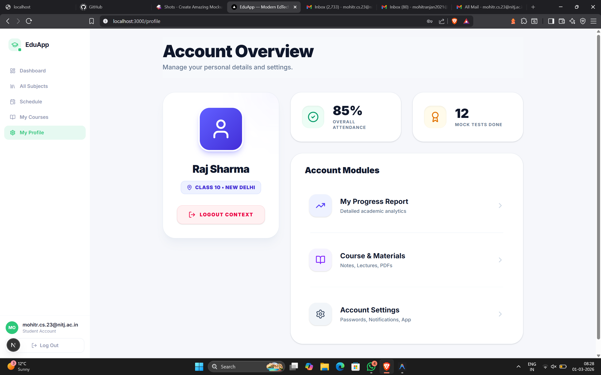
</p>
<p align="center">
  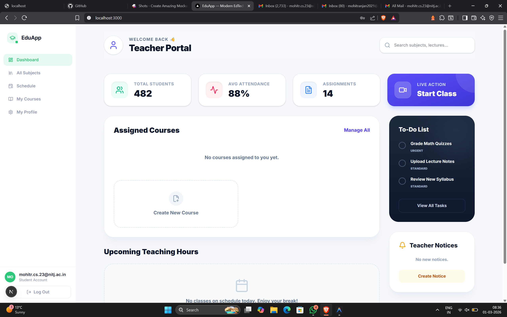
  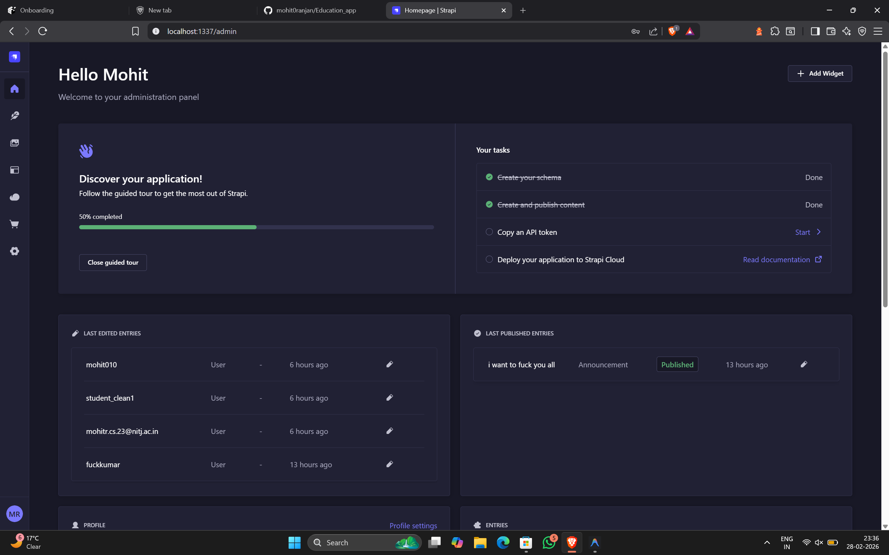
</p>


---

## 🛠 Tech Stack

### 🗄️ Backend
- **[Strapi v5](https://strapi.io/)** — Headless CMS with REST & GraphQL API
- **PostgreSQL** / **SQLite** — Relational database (configurable per environment)
- **Nodemailer** — Transactional email via SMTP

### 💻 Web Frontend
- **[Next.js 14](https://nextjs.org/)** — React framework with App Router, SSR & SSG
- **[Tailwind CSS](https://tailwindcss.com/)** — Utility-first styling
- **React** — Component-driven UI

### 📱 Mobile
- **[React Native](https://reactnative.dev/)** — Cross-platform iOS & Android
- **[Expo](https://expo.dev/)** — Managed workflow, OTA updates, dev tooling
- **[Zustand](https://zustand-demo.pmnd.rs/)** — Lightweight global state management

### 🔐 Auth & Security
- **JWT** — Stateless, token-based authentication
- **RBAC** — Role-Based Access Control enforced at API level via Strapi filters

---

## 📂 Project Structure

```
EducatIN/
├── backend/              # Strapi v5 — API, content types, plugins
│   ├── src/
│   │   ├── api/          # Content type controllers & routes
│   │   └── plugins/      # Strapi plugin configurations
│   └── .env.example
│
├── frontend/             # Next.js 14 — Web dashboard
│   ├── app/              # App Router: layouts, pages, loading states
│   ├── components/       # Reusable UI components
│   ├── lib/              # API clients, helpers, utilities
│   └── .env.example
│
├── mobile/               # React Native — Expo app
│   ├── app/              # Expo Router: screens & navigation
│   ├── components/       # Shared UI components
│   ├── store/            # Zustand state stores
│   └── .env.example
│
└── images/               # Screenshots & assets for README
```

---

## ✨ Features

### 🎓 Students
- Browse and enroll in available courses
- Watch video lectures and download PDF study materials
- Join live classes via integrated session links
- Receive real-time announcements from teachers

### 👨‍🏫 Teachers
- Role-scoped dashboard — access only assigned courses
- Upload video lectures and manage course content
- Schedule and broadcast live sessions
- Post announcements directly to enrolled students

### 🛡️ Admins
- Centralized user, role, and course management via Strapi
- Assign teachers to specific courses
- Full content control and platform-wide oversight

---

## 🚀 Getting Started

### Prerequisites

Ensure the following are installed on your machine:

- [Node.js](https://nodejs.org/) `>= 18.x`
- [npm](https://www.npmjs.com/) or [Yarn](https://yarnpkg.com/)
- [Expo CLI](https://docs.expo.dev/get-started/installation/) *(for mobile development)*

---

### 1. Clone the Repository

```bash
git clone https://github.com/your-username/educatin.git
cd educatin
```

### 2. Backend — Strapi CMS

```bash
cd backend
cp .env.example .env
npm install
npm run develop
```

> ✅ Admin panel available at: `http://localhost:1337/admin`

### 3. Frontend — Next.js Web App

```bash
cd ../frontend
cp .env.example .env.local
npm install
npm run dev
```

> ✅ Web app available at: `http://localhost:3000`

### 4. Mobile — Expo App

```bash
cd ../mobile
cp .env.example .env
npm install
npx expo start
```

> ✅ Scan the QR code with **Expo Go** on Android/iOS, or press `i` / `a` for emulator.

---

## 🔐 Environment Variables

> ⚠️ Never commit `.env` files to version control. Add them to `.gitignore`.

### `backend/.env`

```env
# Database
DATABASE_CLIENT=sqlite            # or "postgres" for production
DATABASE_FILENAME=.tmp/data.db    # SQLite only

# Mail (SMTP)
SMTP_HOST=smtp.example.com
SMTP_PORT=587
SMTP_USERNAME=your@email.com
SMTP_PASSWORD=your_password

# Security (generate strong random values)
APP_KEYS=key1,key2
API_TOKEN_SALT=your_salt
ADMIN_JWT_SECRET=your_admin_secret
JWT_SECRET=your_jwt_secret
```

### `frontend/.env.local`

```env
NEXT_PUBLIC_STRAPI_API_URL=http://localhost:1337
```

### `mobile/.env`

```env
# Use your machine's LOCAL IP — "localhost" will not work on a physical device
EXPO_PUBLIC_API_URL=http://192.168.x.x:1337
```

---

## 🛡️ Role-Based Access Control (RBAC)

Data isolation is enforced at the API level. Teachers only receive data for their assigned courses via Strapi's query filters:

```http
GET /api/courses?filters[teacher][id][$eq]={{USER_ID}}&populate=*
```

Roles (`student`, `teacher`, `admin`) are managed in Strapi and validated on every authenticated request by decoding the JWT payload server-side.

---

## 🤝 Contributing

Contributions, issues, and feature requests are welcome!

1. Fork the repository
2. Create your feature branch — `git checkout -b feat/your-feature`
3. Commit your changes — `git commit -m "feat: describe your change"`
4. Push to your branch — `git push origin feat/your-feature`
5. Open a Pull Request

Please follow the [Conventional Commits](https://www.conventionalcommits.org/) specification for commit messages.

---

## 📄 License

Licensed under the **MIT License** — see [LICENSE](./LICENSE) for full details.

---

## 👤 Author

<div align="center">

**Mohit Ranjan** — Full Stack Developer

<p>
  <a href="https://github.com/mohitranjan">
    
  </a>
  &nbsp;
  <a href="https://linkedin.com/in/mohitranjan">
    
  </a>
</p>

</div>

---

<div align="center">


<sub>⭐ If EducatIN helped or inspired you, drop a star — it keeps the project alive!</sub>

</div>
